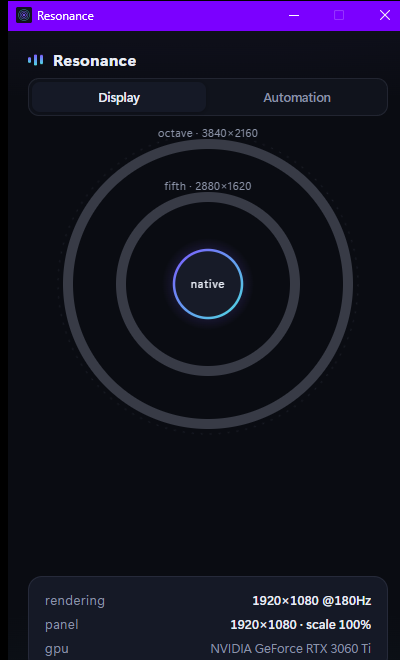
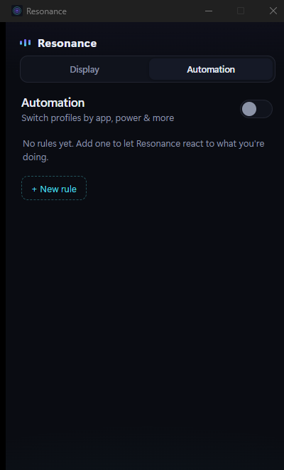

<div align="center">

# Resonance

**Super-resolution for your entire desktop.**
*RESO·lution·NANCE — render beyond your panel, everywhere, not just in games.*

[](docs/ROADMAP.md)
[](https://github.com/nkVas1/Resonance/actions/workflows/ci.yml)
[](#requirements)
[](docs/adr/0002-tech-stack.md)
[](LICENSE)

&nbsp;&nbsp;

</div>

---

## What is this?

Your GPU can render the whole OS at a resolution **higher than your monitor supports** — 2880×1620 or 3840×2160 on a 1080p panel — and downsample it back with a high-quality (even AI-powered) filter. The result is dramatically sharper text, cleaner edges and richer detail in *every* application: browser, IDE, photo editors, video, desktop itself.

The technology already ships inside GPU drivers (NVIDIA **DSR / DLDSR**, AMD **VSR**), but it is buried in control panels, has zero automation, breaks DPI scaling, and nobody uses it outside games.

**Resonance** turns it into a first-class experience:

- 🔆 **One click / hotkey** to shift the entire desktop into super-resolution and back.
- 🎚️ **Automatic DPI compensation** — text stays physically the same size, just sharper (via per-monitor DPI control).
- 🤖 **Per-app automation** — Photoshop in the foreground? 2.25× DLDSR kicks in. Game closed? Native restored. On battery? Stay native.
- 🛟 **Safety rails** — every switch auto-reverts unless confirmed; no black-screen dead ends.
- 🖥️ **Tray-first UX** with a designed, animated control center — not another gray settings dialog.

## How it works

```
┌─────────────────────────────────────────────────────────────┐
│  OS composites everything at 2880×1620 / 3840×2160 (virtual) │
│      desktop · browser · apps · games — all supersampled     │
└──────────────────────────┬──────────────────────────────────┘
                           │  GPU driver downsample
                           │  (13-tap Gaussian / DL filter)
┌──────────────────────────▼──────────────────────────────────┐
│              Physical panel @ native 1920×1080               │
└─────────────────────────────────────────────────────────────┘
```

Resonance drives three control planes in concert:

| Plane | Component | Mechanism |
|---|---|---|
| Driver super-resolution | **Tuner** | NVAPI DRS (DSR/DLDSR factors & smoothness); AMD ADLX VSR planned |
| Display mode & safety | **Tuner** | Win32 `ChangeDisplaySettingsEx` / `SetDisplayConfig` + revert timer |
| DPI compensation | **Tuner** | Per-monitor DPI via `DisplayConfig(Get/Set)DeviceInfo` |
| Rules & automation | **Conductor** | Process/foreground/power watchers → declarative profiles |
| Control center UI | **Chamber** | Tauri 2 + Svelte 5, tray-first, motion-driven design |

Deep dive: [docs/ARCHITECTURE.md](docs/ARCHITECTURE.md).

## Why not just NVIDIA Control Panel / Magpie / Lossless Scaling?

| Capability | NVIDIA Panel | Magpie | Lossless Scaling | **Resonance** |
|---|:---:|:---:|:---:|:---:|
| System-wide (desktop & all apps) | ◑ | ✕ | ✕ | **✓** |
| True above-native rendering | ✓ | ✕ | ✕ | **✓** |
| Automatic DPI compensation | ✕ | ✕ | ✕ | **✓** |
| Per-app automation | ✕ | ◑ | ✕ | **✓** |
| One-click / hotkey switching | ✕ | ✓ | ✓ | **✓** |
| Crash-safe auto-revert | ✕ | ✕ | ✕ | **✓** |
| Free & open source | ✓ | ✓ | ✕ | **✓** |

- **NVIDIA Control Panel** exposes DSR as a raw checkbox: no desktop workflow, no DPI fix, no per-app logic, no hotkeys.
- **[Magpie](https://github.com/Blinue/Magpie)** and **Lossless Scaling** upscale *a single window* via capture — great for games, but they don't (and can't) raise the real desktop resolution system-wide.
- Resonance is **driver-first**: the OS genuinely renders more pixels, so *everything* benefits natively — no capture overhead, no cursor quirks, no per-window setup. Rationale: [ADR-0001](docs/adr/0001-driver-first-super-resolution.md).

## Quick start

No signed release yet — build from source (a few minutes):

```bash
git clone https://github.com/nkVas1/Resonance
cd Resonance

# Try the engine right now — capability report for your machine
cargo run -p resctl -- doctor
cargo run -p resctl -- apply fifth      # 1.5× supersampled desktop, auto-reverts if unconfirmed

# Build the desktop app (Chamber)
cd apps/chamber
pnpm install
pnpm tauri build                        # -> target/release/bundle/nsis/Resonance_*-setup.exe
```

`resctl` verbs: `doctor · status · modes · profiles · apply <profile> [-y] · native · revert · dpi [pct]`.

## Requirements

- Windows 11 (Windows 10 21H2+ best-effort)
- A GPU exposing above-native modes: NVIDIA **DSR/DLDSR** (GTX 900+ / RTX for DLDSR), AMD **VSR**, or Intel scaling — enable it once in your GPU's control panel; Resonance's `doctor` tells you if it's ready and how.
- The core chain is **vendor-agnostic** — it drives any above-native mode Windows exposes. NVAPI is used only for informational detection.

## Status

**Phases 0–4 complete; Phase 5 (release) in progress.** The engine, CLI, control center and automation all work today. See [docs/ROADMAP.md](docs/ROADMAP.md) and [CHANGELOG.md](CHANGELOG.md).

## Project layout

```
crates/
  resonance-core/   # domain model: config, profiles, rules, revert guard
  tuner/            # display modes · DPI · vendor detection (unsafe FFI lives here)
  conductor/        # rules engine + process/power/foreground watchers
apps/
  chamber/          # Tauri 2 + Svelte 5 control center (tray-first)
  resctl/           # CLI — everything scriptable
poc/drs-probe/      # Phase 0 NVAPI/registry research tool
docs/               # architecture, roadmap, ADRs, research
site/               # landing page (GitHub Pages)
```

## License

[MIT](LICENSE) © 2026 [nkVas1](https://github.com/nkVas1)
